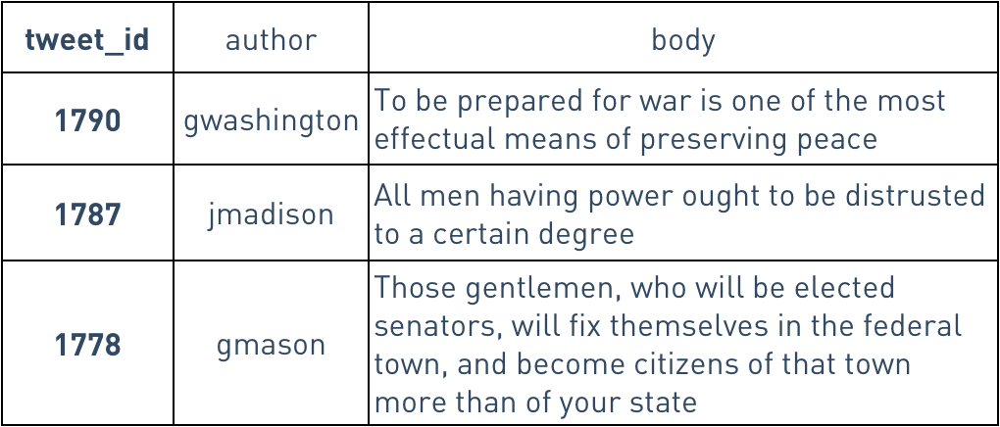
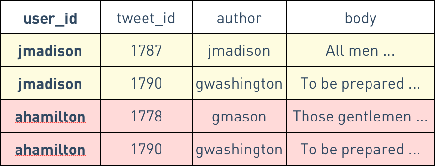

# Schema in Cassandra 1.1

http://www.datastax.com/dev/blog/schema-in-cassandra-1-1

This article tells how CQL improve the old datamodel ('s usability?)

## Referred by

- http://www.datastax.com/dev/blog/cql3-for-cassandra-experts

## Ref

- http://docs.datastax.com/en/archived/cassandra/1.0/docs/cluster_architecture/partitioning.html

## Take away

- Cassandra is a dynamic column row store (in fact a big map with value of the root map also be a map)
- The first column in a compound key definition continues to be used as the partition key, and remaining columns are automatically clustered: that is, all the rows sharing a given partition key will be sorted by the remaining components of the primary key
- all the logical rows with the same partition key get stored as a single physical “wide row.”
- With COMPACT STORAGE, each logical row corresponds to exactly one physical column
- [ ] TODO: different column families use different column as row key, this is different from what is described in the original cassandra (bigtable) paper (which has too little detail)

## Detail

- Cassandra used to be kind of schema less
  - > Using UUIDs as a surrogate key is common in Cassandra, so that you don’t need to worry about sequence or autoincrement synchronization across multiple machines
- [ ] TODO: OpenTSDB has said Cassandra does not handle UUID generation
  - > Additionally, because Cassandra doesn't support atomic mutations, locking for atomic increments is implemented by writing a special lock column and checking the timestamps to see who won with retries if acquisition failed. That means UID assignments will be messy

### Storage Engine (The best of both worlds)

- Cassandra use LSM Tree and SSTable
  - **each row can have different columns**, 'In Cassandra’s storage engine, each row is sparse: for a given row, we store only the columns present in that row.'
  - column names are stored in each row, each row is a map
    - 'store column names redundantly in each row, trading disk space to gain flexibility'
    - 'adding columns to a Cassandra table always only takes a few milliseconds'
- RDBMS use b-trees
  - **every row must have same columns**
  - column names are not stored in each row, each row is a tuple
    - In a static-column storage engine, each row must reserve space for every column
    - 'adding columns to RDBMS requires re-allocate space row by row'

### Clustering, compound keys and more

- 'Starting in the upcoming Cassandra 1.1 release, CQL (the Cassandra Query Language) supports defining column families with compound primary keys. The first column in a compound key definition continues to be used as the partition key, and remaining columns are automatically clustered: that is, all the rows sharing a given partition key will be sorted by the remaining components of the primary key.'
  - [x] column family is like table in RDBMS ~~defined using compound key?~~
  - [x] Clustered https://en.wikipedia.org/wiki/Database_index#Clustered
    - the ordering of the physical data rows in accordance with the index blocks that point to them
    - only one clustered index can be created on a given database table
    - greatly increase overall speed of retrieval, but usually only where the data is accessed sequentially in the same or reverse order of the clustered index, or when a range of items is selected
    - [ ] TODO: overhead when write in different order
  - row key == partition key == first column in a compound key definition in CQL
    - [x] http://docs.datastax.com/en/archived/cassandra/1.0/docs/cluster_architecture/partitioning.html
    - [x] http://docs.datastax.com/en/archived/cassandra/1.0/docs/ddl/index.html
- Compound keys can also be useful when denormalizing data for faster queries
  - `PRIMARY KEY (user_id, tweet_id)`
  - `SELECT * FROM timeline WHERE user_id = ? ORDER BY tweet_id DESC LIMIT 20` requires no sorting time

### Under the hood and historical notes

- Cassandra’s storage engine uses composite columns under the hood to store clustered rows. . This means all the logical rows with the same partition key get stored as a single physical “wide row.”
- This is why Cassandra supports up to 2 billion columns per (physical) row, and why Cassandra’s old Thrift api has methods to take “slices” of such rows.

````
CREATE TABLE timeline (
    user_id varchar,
    tweet_id uuid,
    author varchar,
    body varchar,
    PRIMARY KEY (user_id, tweet_id)
);
````

The user and twitter are as following, we insert new record into user's timeline when someone he followed tweet something



The logical representation (what you get using Cqlsh via CQL)



The physical representation


The physical representation with COMPACT STORAGE

- The  WITH COMPACT STORAGE directive is provided for backwards compatibility with older Cassandra applications
- Using COMPACT STORAGE will prevent you from adding new columns that are not part of the PRIMARY KEY
- With COMPACT STORAGE, each logical row corresponds to exactly one physical column
- NOTE: the last cell is a typo, it should be `(1790, gwashington): To be prepared ...`


